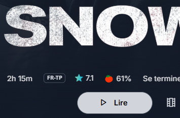
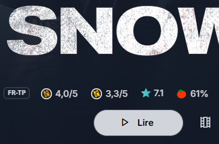

# Jellyfin Allociné Ratings Plugin

<p align="center">
  
  
  
  
  
</p>

<p align="center">
  
  
</p>

<p align="center">
  <strong>Seamlessly integrate French Allociné ratings into your Jellyfin instance.</strong>
</p>

---

## 📖 Overview

The **Jellyfin Allociné Plugin** automatically fetches and displays movie ratings from **Allociné** (the leading French cinema database) directly onto your Jellyfin movie details page.

Unlike standard metadata providers, this plugin injects the specific **"Presse" (Critics)** and **"Spectateurs" (Audience)** scores alongside standard ratings, using the official Allociné visual style. It is designed for French-speaking users who rely on these specific metrics to choose their next movie.

### ✨ Key Features

-   **Dual Ratings:** Displays both _Press_ and _Spectator_ scores.
-   **Native Look & Feel:** Uses official Allociné icons and specific French number formatting (e.g., `3,5/5`).
-   **Smart Matching:** Uses a robust matching algorithm based on Title and Year to find the correct film.
-   **Idempotent Injection:** Advanced DOM observation logic ensures ratings are injected once and persist correctly during single-page navigation without performance loops.
-   **Auto-Update:** Ratings are fetched dynamically when the page loads.

---

## 🖼️ Screenshots

|            Before             |         After          |
| :---------------------------: | :--------------------: |
| _Standard Jellyfin Interface_ | _With Allociné Plugin_ |
|     |  |

> _Note: The ratings appear next to the official certification or duration on the movie details page._

---

## ⚙️ How It Works (Technical Insight)

This plugin utilizes a hybrid approach combining a C# backend controller and a JavaScript frontend injection.

### 1. Reverse-Engineered GraphQL API

Instead of parsing heavy HTML pages, this plugin communicates directly with Allociné's internal **GraphQL API**, which was identified by reverse-engineering the official Allociné mobile application.

### 2. Anonymous JWT Authentication

The API requires authentication. The plugin utilizes a hardcoded, generic **Anonymous JWT (JSON Web Token)** extracted from the mobile application logic. This allows the plugin to query the `MovieMini` and `Search` endpoints without requiring individual user accounts or API keys.

### 3. DOM Injection via Reflection

The plugin serves a custom JavaScript file (`allocine.js`) which is injected into the Jellyfin Web UI. This script observes the DOM changes (MutationObserver) to detect when a user navigates to a movie page, fetches the data from the C# controller, and dynamically inserts the rating badges into the HTML.

---

## ⚠️ Prerequisites

To function correctly, this plugin requires:

1.  **Jellyfin Server:** Version **10.9.x** or later.
2.  **File Transformation Plugin:** This plugin is required to inject the necessary JavaScript into the UI. You can find it [here](https://github.com/IAmParadox27/jellyfin-plugin-file-transformation).

---

## 🚀 Installation

### Option 1: Automatic Install (Repository)

1.  Open your Jellyfin Dashboard.
2.  Navigate to **Plugins** > **Repositories**.
3.  Add the following repository URL:
    ```
    [https://raw.githubusercontent.com/charlesbel/Jellyfin.Plugin.Allocine/master/manifest.json](https://raw.githubusercontent.com/charlesbel/Jellyfin.Plugin.Allocine/master/manifest.json)
    ```
4.  Go to the **Catalog**, find **Allocine Ratings**, and install it.
5.  **Restart your Jellyfin server.**

### Option 2: Manual Install

1.  Download the latest `.dll` from the [Releases Page](https://github.com/charlesbel/Jellyfin.Plugin.Allocine/releases).
2.  Place the `Jellyfin.Plugin.Allocine.dll` file into your Jellyfin plugins folder:
    -   **Linux:** `/var/lib/jellyfin/plugins/Allocine/`
    -   **Windows:** `C:\ProgramData\Jellyfin\Server\plugins\Allocine\`
    -   **Docker:** `/config/plugins/Allocine/`
3.  **Restart your Jellyfin server.**

---

## 🛠️ Build from Source

If you want to contribute or build the plugin yourself:

1.  **Clone the repository:**

    ```bash
    git clone [https://github.com/charlesbel/Jellyfin.Plugin.Allocine.git](https://github.com/charlesbel/Jellyfin.Plugin.Allocine.git)
    cd Jellyfin.Plugin.Allocine
    ```

2.  **Build the project:**

    ```bash
    dotnet publish --configuration Release --output bin/Release/net9.0/publish
    ```

3.  **Copy artifacts:**
    Copy the contents of `bin/Release/net9.0/publish` to your Jellyfin plugins directory.

---

## 🤝 Contributing

Contributions are welcome! Please follow these steps:

1.  Fork the repository.
2.  Create your feature branch (`git checkout -b feature/AmazingFeature`).
3.  Commit your changes (`git commit -m 'Add some AmazingFeature'`).
4.  Push to the branch (`git push origin feature/AmazingFeature`).
5.  Open a Pull Request.

---

## ⚖️ License

Distributed under the **GNU General Public License v3.0**. [cite_start]See `LICENSE` for more information[cite: 197].

---

## 📝 Disclaimer

This plugin is not officially affiliated with, associated with, authorized by, endorsed by, or in any way officially connected with **Allociné** or **The Webedia Group**. All product and company names are trademarks™ or registered® trademarks of their respective holders. Use of them does not imply any affiliation with or endorsement by them.
