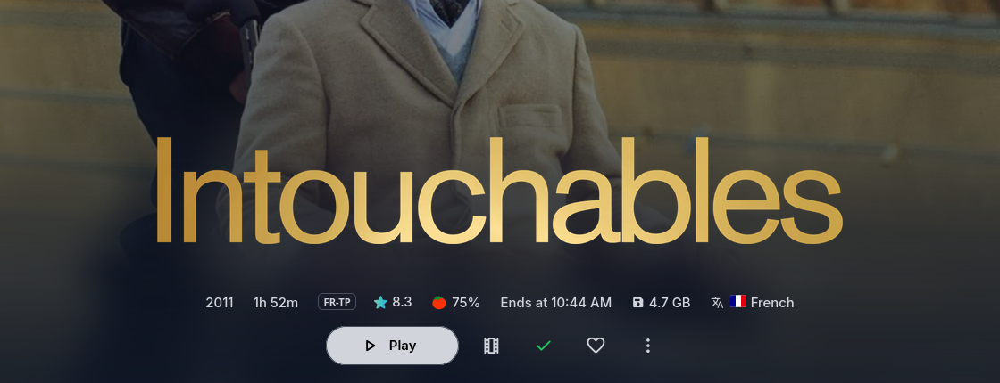
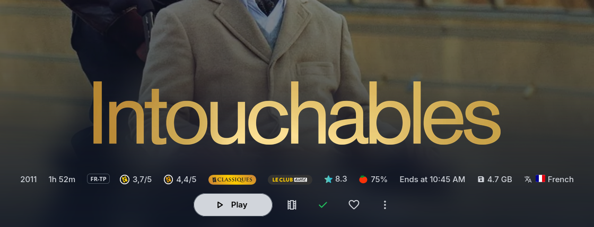

# Jellyfin Allociné Ratings Plugin

<p align="center">
  
  
  
  
  
</p>

<p align="center">
  
  
</p>

<p align="center">
  <strong>Seamlessly integrate French Allociné ratings into your Jellyfin instance.</strong>
</p>

---

## 📖 Overview

The **Jellyfin Allociné Plugin** automatically fetches and displays movie ratings from **Allociné** (the leading French cinema database) directly onto your Jellyfin movie details page.

Unlike standard metadata providers, this plugin injects the specific **"Presse" (Critics)** and **"Spectateurs" (Audience)** scores alongside standard ratings, using the official Allociné visual style. It is designed for French-speaking users who rely on these specific metrics to choose their next movie.

### ✨ Key Features

-   **Dual Ratings:** Displays both _Press_ and _Spectator_ scores.
-   **Native Look & Feel:** Uses official Allociné icons and specific French number formatting (e.g., `3,5/5`).
-   **Smart Matching:** Uses a robust matching algorithm based on Title and Year to find the correct film.
-   **Resilient Mobile Authentication:** Reproduces the anonymous authentication flow used by the current Allociné Android application and renews it automatically when rejected.
-   **Safe Public Fallback:** Falls back to the public movie page if the mobile API is unavailable, while refusing Cloudflare challenge or malformed pages.
-   **Idempotent Injection:** Advanced DOM observation logic ensures ratings are injected once and persist correctly during single-page navigation without performance loops.
-   **Auto-Update:** Ratings are fetched dynamically when the page loads.

---

## 🖼️ Screenshots

|            Before             |         After          |
| :---------------------------: | :--------------------: |
| _Standard Jellyfin Interface_ | _With Allociné Plugin_ |
|     |  |

> _Note: The ratings appear next to the official certification or duration on the movie details page._

---

## ⚙️ How It Works (Technical Insight)

This plugin utilizes a hybrid approach combining a C# backend controller and a JavaScript frontend injection.

### 1. Movie Matching and GraphQL Ratings

The backend first uses Allociné's public autocomplete endpoint to identify the correct movie from its title and release year. It then retrieves the full-precision Press and Audience ratings from the internal **GraphQL API** used by the official Allociné Android application.

### 2. Anonymous Mobile Authentication

The current mobile API requires an additional FCM registration token. The plugin creates an anonymous Android Check-in identity, registers it for the official Allociné application through Google's `register3` endpoint, and sends the resulting token as `AC-Auth-Token`.

No Allociné account or user-provided API key is required. Generated device credentials and tokens are kept **in memory only**, never written to disk or logs. The token is cached for the plugin process and renewed once if GraphQL rejects it.

### 3. Fail-Closed Public Page Fallback

If anonymous registration or GraphQL is unavailable, the backend can extract the rounded Press and Audience ratings from the public Allociné movie page. The parser rejects Cloudflare challenges, incomplete pages, and ambiguous rating blocks instead of returning potentially incorrect values. It does not attempt to bypass anti-bot challenges.

### 4. DOM Injection via Reflection

The plugin serves a custom JavaScript file (`allocine.js`) which is injected into the Jellyfin Web UI. This script observes the DOM changes (MutationObserver) to detect when a user navigates to a movie page, fetches the data from the C# controller, and dynamically inserts the rating badges into the HTML.

---

## ⚠️ Prerequisites

To function correctly, this plugin requires:

1.  **Jellyfin Server:** Version **10.9.x** or later.
2.  **File Transformation Plugin:** This plugin is required to inject the necessary JavaScript into the UI. You can find it [here](https://github.com/IAmParadox27/jellyfin-plugin-file-transformation).

---

## 🚀 Installation

### Option 1: Automatic Install (Repository)

1.  Open your Jellyfin Dashboard.
2.  Navigate to **Plugins** > **Repositories**.
3.  Add the following repository URL:
    ```
    https://raw.githubusercontent.com/charlesbel/Jellyfin.Plugin.Allocine/master/manifest.json
    ```
4.  Go to the **Catalog**, find **Allocine Ratings**, and install it.
5.  **Restart your Jellyfin server.**

### Option 2: Manual Install

1.  Download the latest `.dll` from the [Releases Page](https://github.com/charlesbel/Jellyfin.Plugin.Allocine/releases).
2.  Place the `Jellyfin.Plugin.Allocine.dll` file into your Jellyfin plugins folder:
    -   **Linux:** `/var/lib/jellyfin/plugins/Allocine/`
    -   **Windows:** `C:\ProgramData\Jellyfin\Server\plugins\Allocine\`
    -   **Docker:** `/config/plugins/Allocine/`
3.  **Restart your Jellyfin server.**

---

## 🛠️ Build from Source

If you want to contribute or build the plugin yourself:

1.  **Clone the repository:**

    ```bash
    git clone https://github.com/charlesbel/Jellyfin.Plugin.Allocine.git
    cd Jellyfin.Plugin.Allocine
    ```

2.  **Build the project:**

    ```bash
    dotnet publish Jellyfin.Plugin.Allocine/Jellyfin.Plugin.Allocine.csproj --configuration Release
    ```

3.  **Copy artifacts:**
    Copy the contents of `Jellyfin.Plugin.Allocine/bin/Release/net9.0/publish` to your Jellyfin plugins directory.

---

## 🤝 Contributing

Contributions are welcome! Please follow these steps:

1.  Fork the repository.
2.  Create your feature branch (`git checkout -b feature/AmazingFeature`).
3.  Commit your changes (`git commit -m 'Add some AmazingFeature'`).
4.  Push to the branch (`git push origin feature/AmazingFeature`).
5.  Open a Pull Request.

---

## ⚖️ License

Distributed under the **GNU General Public License v3.0**. See `LICENSE` for more information.

---

## 📝 Disclaimer

This plugin is not officially affiliated with, associated with, authorized by, endorsed by, or in any way officially connected with **Allociné** or **The Webedia Group**. All product and company names are trademarks™ or registered® trademarks of their respective holders. Use of them does not imply any affiliation with or endorsement by them.
